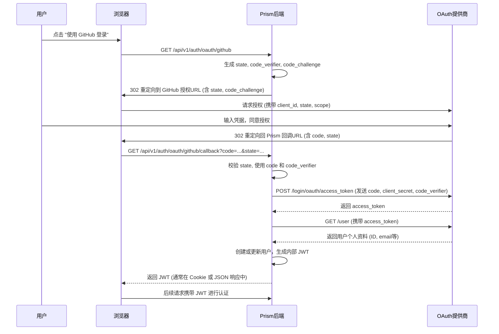
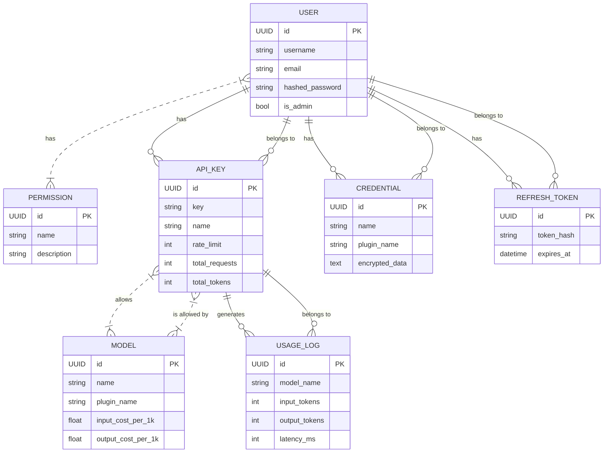

# Prism 项目文档

> 文档索引与更新记录
- 函数文档（精简、可检索）：见 docs/函数文档.md
- 锁文件与沙箱机制详解：见 docs/锁文件保护机制.md
- 插件开发指南（规范与示例）：见 docs/插件开发指南.md

最近更新：
- 新增函数文档，覆盖审计沙箱/插件加载/OAuth 注册表/安全工具/运行时
- 在本项目文档中加入索引，便于快速跳转与定位函数定义

## 1. 架构总览

本项目 **Prism** 是一个基于 **FastAPI** 框架构建的现代化 Python Web 应用。其结构清晰，模块化程度高，核心功能围绕着一个复杂的 **OAuth 认证系统** 和一个可扩展的 **插件化架构**。

### 1.2 快速上手

本项目推荐使用 Docker 和 Docker Compose 进行部署和开发。

1.  **环境准备**:
    *   安装 [Docker](https://www.docker.com/) 和 [Docker Compose](https://docs.docker.com/compose/install/)。
    *   克隆本项目到本地。

2.  **配置**:
    *   将 `env.example` 文件复制为 `.env`。
    *   根据需要修改 `.env` 文件中的配置，例如数据库连接信息、密钥等。

3.  **启动应用**:
    在项目根目录执行以下命令：
    ```bash
    docker-compose up --build
    ```
    该命令会构建 Docker 镜像并启动所有服务。

4.  **访问**:
    应用启动后，可以通过 `http://localhost:8080` (或你在配置中指定的端口) 访问。健康检查端点位于 `http://localhost:8080/`。

### 1.3 技术栈与启动流程

-   **Web 框架**: **FastAPI**
-   **服务器**: **Uvicorn**
-   **依赖管理**: 通过 `Dockerfile` 和 `docker-compose.yml` 管理，尽管 `requirements.txt` 文件为空，依赖项可能已包含在基础镜像或构建脚本中。
-   **启动入口**: `run.py` 文件是本地开发的启动脚本，它导入 `app.main` 中的 FastAPI 实例 `app`，并使用 `uvicorn` 启动一个 Web 服务器。
-   **容器化启动**: 在 Docker 环境中，`CMD` 指令直接使用 `uvicorn` 启动应用，并暴露 `8080` 端口。

## 2. 核心模块分析

### 2.1 认证 (OAuth)

Prism 的认证系统设计精良，采用 **注册表模式 (Registry Pattern)** 和 **策略模式 (Strategy Pattern)**，实现了高度的可扩展性和解耦。

#### 2.1.1 核心组件

1.  **`OAuthProviderRegistry` (`app/core/oauth_registry.py`)**:
    *   **职责**: 认证系统的“大脑”，负责动态发现、加载和管理所有可用的 OAuth 提供商。
    *   **机制**: 在应用启动时，它会自动扫描 `app/oauth_providers` 目录下的所有 Python 文件。通过 `importlib` 和 `inspect`，它找到所有继承自 `BaseOAuthProvider` 的类，并实例化它们。
    *   **配置加载**: 每个提供商的实例化会触发其配置加载。`BaseOAuthProvider` 中的 `load_config` 方法会寻找与提供商同名的 `.yml` 文件（例如 `github.yml` 或 `google.yml`）。
        *   如果 `.yml` 文件**不存在**，它会检查是否存在对应的 `.yml.example` 文件。如果示例文件也不存在，它会自动创建一个，其中包含必要的配置项（`client_id`, `client_secret`, `redirect_uri`）。
        *   随后，它会抛出一个 `FileNotFoundError`，这个错误会被上层的 `OAuthProviderRegistry` 捕获，从而**安全地跳过**该未配置的提供商，而不是中断整个应用的启动。这是一种引导式配置，既健壮又对开发者友好。
        *   如果 `.yml` 文件存在但内容不合法（如缺少关键字段），则会抛出 `ValueError`。

2.  **`BaseOAuthProvider` (`app/oauth_providers/base.py`)**:
    *   **职责**: 这是一个抽象基类（ABC），定义了所有 OAuth 提供商必须遵守的“契约”或接口。
    *   **核心方法 (必须实现)**:
        *   `build_authorize_url(state, code_challenge)`: 构建用于重定向用户的第三方授权 URL。
        *   `exchange_code(code, code_verifier)`: 使用从回调中获取的 `code`，向提供商换取 `access_token`。
        *   `fetch_profile(token_data)`: 使用 `access_token` 从提供商 API 获取用户个人资料。

3.  **具体提供商实现 (例如 `github.py`, `google.py`)**:
    *   **职责**: 实现 `BaseOAuthProvider` 的所有抽象方法，处理与特定第三方（如 GitHub, Google）的所有 API 交互。
    *   **实现**: 项目内置了 `GitHubOAuthProvider` 和 `GoogleOAuthProvider`。它们都使用 `httpx` 库进行异步 HTTP 通信，完成授权、令牌交换和用户信息获取的完整流程。
    *   **激活**: 一个提供商只有在 `app/oauth_providers/` 目录下存在对应的 `provider_name.yml` 配置文件时才会被加载和激活。

#### 2.1.2 认证流程图 (OAuth 2.0 Authorization Code Flow with PKCE)



#### 2.1.4 API 端点实现 (`app/api/v1/oauth.py`)

API 层是整个认证流程的入口和终点，它完美地串联了核心逻辑。

1.  **`GET /auth/oauth/{provider}/authorize`**:
    *   **功能**: 启动认证流程。
    *   **执行逻辑**:
        1.  根据 URL 中的 `provider` 动态获取对应的提供商实例。
        2.  生成并缓存 `state` (用于 CSRF 防护) 和 `code_verifier` (用于 PKCE)。
        3.  调用提供商的 `build_authorize_url` 方法生成重定向 URL。
        4.  将 URL 返回给前端，由前端执行重定向。

2.  **`GET /auth/oauth/{provider}/callback`**:
    *   **功能**: 处理第三方回调，完成用户认证和登录。
    *   **执行逻辑**:
        1.  严格校验回调参数中的 `state`，与缓存中的值进行比对，失败则拒绝请求。
        2.  使用 `code` 和缓存的 `code_verifier` 调用提供商的 `exchange_code` 方法换取令牌。
        3.  调用 `fetch_profile` 获取用户信息。
        4.  在本地数据库中“更新或插入 (Upsert)”用户。如果用户不存在，则根据获取的 profile 创建一个新用户。
        5.  为该用户生成系统内部的 JWT (`access_token` 和 `refresh_token`)。
        6.  清理已使用的 `state` 缓存。
        7.  重定向到 `static/callback.html`，通过 URL 参数将令牌传递给前端。

这套实现充分利用了 FastAPI 的依赖注入 (`Depends`) 来获取数据库会话和配置，代码整洁且高效。

### 2.2 插件系统

Prism 的插件系统是其强大功能和高度可扩展性的核心。它被设计成一个安全、健壮、且对开发者友好的框架，允许在不修改核心代码的情况下为系统添加新功能。

该系统主要由三部分组成：
- **接口契约 (`interface.py`)**: 定义了所有插件必须遵守的规则和能力。
- **加载引擎 (`loader.py`)**: 负责发现、验证、解析依赖并安全地加载插件。
- **执行引擎 (`chain_runner.py`)**: 负责按预定义的顺序（调用链）执行插件。

#### 2.2.1 核心概念

- **`PluginInterface` (插件接口)**: 所有插件都必须继承的抽象基类。它定义了插件的生命周期 (`initialize`, `shutdown`)、元数据 (`get_metadata`) 和核心处理逻辑 (`handle`)。
- **`MetaPlugin` (元插件)**: 一种特殊的插件，它可以包含一组子插件，并定义由这些子插件组成的预设“调用链”。这极大地增强了功能的模块化和复用性。
- **`RequestContext` (请求上下文)**: 一个在插件调用链中传递的对象，用于携带请求/响应数据，并在插件之间共享状态。插件可以通过调用 `context.short_circuit()` 来提前中断调用链。
- **`SandboxPermission` (沙箱权限)**: 插件必须在其元数据中明确声明所需权限（如网络访问、文件读写、数据库访问等）。系统会严格执行“最小权限原则”，任何越权行为都会被阻止。
- **中间件模式**: 插件的执行遵循经典的中间件（Middleware）模式。每个插件在执行时都会收到一个 `next_plugin` 回调函数。调用此函数会将控制权交给链中的下一个插件；反之，不调用则会“短路”调用链。

#### 2.2.2 插件的生命周期：加载与初始化

`PluginLoader` 负责插件的整个加载过程，这是一个严谨且安全的多阶段流程：

1.  **发现 (Discovery)**: 扫描 `plugins/` 目录下的所有子目录。
2.  **元数据解析 (Metadata Parsing)**: 不加载任何 Python 代码，而是先读取每个插件目录下的 `plugin.yml` 或 `plugin.json` 文件，获取插件名、版本、作者、权限和 **依赖关系**。
3.  **依赖解析 (Dependency Resolution)**: 使用 `DependencyResolver` 根据所有插件的依赖关系构建一个有向图，并进行拓扑排序，计算出唯一的、正确的加载顺序。如果检测到循环依赖，加载过程会中止。
4.  **版本校验 (Version Check)**: 在加载每个插件前，检查其依赖的插件版本是否满足 `plugin.yml` 中声明的约束（如 `^1.2.0` 或 `==2.0.1`）。
5.  **签名验证 (Signature Verification)**: (可选) 如果配置开启，会使用 `PluginSignatureVerifier` 检查插件的数字签名是否来自受信任的开发者。
6.  **代码加载 (Code Loading)**: 使用 `importlib` 在一个受控的环境中动态加载插件的 Python 代码。
7.  **实例化与初始化 (Instantiation & Initialization)**: 创建插件类的实例，并调用其 `initialize()` 方法，让插件完成自己的初始化工作（如加载模型、连接外部服务等）。
8.  **动态路由创建 (Dynamic Route Creation)**: 如果插件实现了 `get_route_schema()` 方法并声明了 `API_CREATE_ROUTE` 权限，`PluginLoader` 会根据其提供的 schema 动态地创建 FastAPI 路由，并将其挂载到主应用上。

#### 2.2.3 插件的执行：调用链

插件的执行由 `ChainRunner` 负责，其工作流程如下：

1.  当一个 API 请求到达时，`ChainRunner` 会根据请求的路由查找与之关联的插件调用链。
2.  它会解析调用链，展开其中的元插件引用（如 `meta_plugin.sub_plugin`）。
3.  然后，它创建一个 `RequestContext` 对象，并从调用链的第一个插件开始，依次调用其 `handle` 方法。
4.  每个插件在 `handle` 方法中完成自己的逻辑，然后可以选择调用 `next_plugin` 回调将 `RequestContext` 传递给下一个插件，或者直接返回，从而短路整个调用链。
5.  最后一个插件执行完毕后，`ChainRunner` 从 `RequestContext` 中提取最终的 `response_data` 并返回给客户端。

#### 2.2.4 如何创建一个新插件

创建一个新插件非常简单，只需遵循以下步骤：

1.  **创建目录**: 在 `plugins/` 目录下创建一个以你的插件名命名的文件夹，例如 `my_awesome_plugin`。

2.  **编写清单文件**: 在插件目录中创建一个 `plugin.yml` 文件，用于描述插件的元数据。

    ```yaml
    # plugins/my_awesome_plugin/plugin.yml
    name: "My Awesome Plugin"
    version: "1.0.0"
    author: "Your Name"
    description: "This is a demonstration of a powerful plugin."
    
    # 声明此插件依赖另一个名为 'another_plugin' 的插件，且其版本必须是 1.x 系列
    dependencies:
      - "another_plugin@^1.0.0"
      
    # 声明此插件需要的权限
    permissions:
      # 需要向 example.com 发起 HTTPS 请求
      - type: "network.domain"
        resource: "example.com"
        description: "Fetch data from example.com"
      # 需要创建自己的 API 路由
      - type: "api.create_route"
        description: "Provide a public API endpoint for this plugin."
    ```

3.  **编写插件代码**: 在插件目录中创建一个 `plugin.py` 或 `__init__.py` 文件，并实现 `PluginInterface`。

    ```python
    # plugins/my_awesome_plugin/plugin.py
    from app.plugins.interface import PluginInterface, PluginMetadata, SandboxPermission, PermissionType, RequestContext
    from typing import List, Dict, Any, Callable, Coroutine
    
    class MyAwesomePlugin(PluginInterface):
    
        def get_metadata(self) -> PluginMetadata:
            # 返回与 plugin.yml 中一致的元数据
            return PluginMetadata(
                name="My Awesome Plugin",
                version="1.0.0",
                author="Your Name",
                description="This is a demonstration of a powerful plugin.",
                dependencies=["another_plugin"],
                permissions=[
                    SandboxPermission(type=PermissionType.NETWORK_SPECIFIC_DOMAIN, resource="example.com"),
                    SandboxPermission(type=PermissionType.API_CREATE_ROUTE),
                ]
            )
    
        async def initialize(self) -> None:
            # 在这里进行初始化，例如加载模型、读取配置等
            self.logger.info("My Awesome Plugin is initializing!")
    
        async def shutdown(self) -> None:
            # 在这里进行清理工作
            self.logger.info("My Awesome Plugin is shutting down.")
    
        async def handle(self, context: RequestContext, next_plugin: Callable[[RequestContext], Coroutine[Any, Any, None]]):
            # 作为中间件处理请求
            self.logger.info("My plugin is handling the request.")
            
            # 调用下一个插件
            if next_plugin:
                await next_plugin(context)
    
        def get_route_schema(self) -> List[Dict[str, Any]]:
            # 定义一个 API 端点
            return [
                {
                    "method": "GET",
                    "path": "/my-awesome-endpoint",
                    "auth": "user",  # 需要用户认证
                    "handler": "handle_api_request" # 对应下面的 invoke 方法
                }
            ]
    
        async def invoke(self, method_name: str, payload: Dict[str, Any]) -> Any:
            # 实现 get_route_schema 中定义的 handler
            if method_name == "handle_api_request":
                # 使用安全的 HTTP 请求方法
                response = await self._safe_http_request("GET", "https://example.com")
                return {"message": "Hello from my awesome plugin!", "data_from_external": response.text}
            
            return {"error": "Unknown method"}
    
    ```

4.  **重启应用**: 重启 Prism 应用，`PluginLoader` 将会自动发现、加载并激活你的新插件。

#### 2.2.5 插件目录结构与权限详解

##### 理想的插件目录结构

一个结构良好、功能完备的 Prism 插件应该遵循以下目录布局：

```
my_awesome_plugin/
├── __init__.py         # 插件主文件，必须包含一个继承自 PluginInterface 的类
├── plugin.yml          # 插件清单文件，定义元数据、依赖和所需权限
├── routes.schema.json  # (可选) 如果插件需要暴露自己的 API，在此定义路由
├── static/             # (可选) 存放该插件所需的前端静态文件 (JS, CSS, HTML)
└── other_modules/      # (可选) 存放其他辅助代码的目录
    └── __init__.py
```

##### 权限清单详解 (`permissions`)

`plugin.yml` 中的 `permissions` 字段是插件安全的命脉。插件必须明确声明它需要的所有权限，系统将严格执行“最小权限”原则。以下是所有可用权限的完整列表和说明：

*   **网络权限**:
    *   `network.http`: 允许插件发起 HTTP 请求到任意地址。
    *   `network.https`: 允许插件发起 HTTPS 请求到任意地址。
    *   `network.domain`: 允许插件访问特定的网络域名。需要在 `resource` 字段中指定域名，支持通配符，如 `*.example.com`。

*   **文件系统权限**:
    *   `file.read_temp`: 允许插件从系统的临时目录读取文件。
    *   `file.write_temp`: 允许插件向系统的临时目录写入文件。
    *   `file.read_plugin`: 允许插件读取其自身目录下的文件。
    *   `file.write_plugin`: 允许插件写入文件到其自身目录下（**危险**：可能导致插件自我修改）。

*   **系统级权限**:
    *   `system.environment`: 允许插件读取主机的环境变量（**高风险**：可能泄露敏感信息）。
    *   `system.subprocess`: 允许插件创建和执行子进程（**极度危险**：相当于获得了在服务器上执行任意命令的能力）。

*   **数据访问权限**:
    *   `data.user_messages`: 允许插件访问用户的聊天或请求历史数据。
    *   `data.system_config`: 允许插件读取 Prism 主应用的系统级配置。
    *   `config.data_read`: 允许插件读取其专属的、持久化的配置文件（通常位于 `data/{plugin_name}.json`）。
    *   `config.data_write`: 允许插件写入其专属的、持久化的配置文件。
    *   `database.access`: 允许插件通过 `self.get_db_session()` 获取数据库会话，进行增删改查操作。
    *   `database.direct_import`: 允许插件直接导入数据库模型（**危险**：绕过了标准的会话管理，不推荐使用）。

*   **动态执行与 API 权限**:
    *   `api.external_call`: 标记该插件会调用外部 API（用于审计和追踪）。
    *   `dynamic.code_exec`: 允许插件执行动态生成的 Python 代码，如使用 `eval()` 或 `exec()`（**极度危险**）。
    *   `api.create_route`: 允许插件通过 `routes.schema.json` 文件动态地创建自己的 API 端点。

#### 2.2.6 插件沙箱：审计钩子强制沙箱 (`app/core/audit_sandbox.py`)

系统采用了一种先进、轻量且无法被绕过的沙箱机制，它基于 Python 解释器内置的**审计钩子 (Audit Hooks)**，提供了强制性的安全保障。

*   **核心思想**: 不再依赖于将插件代码放入独立的进程中（这会带来高昂的性能开销），而是在**同一个进程**内，通过监听解释器级别的底层事件（如文件打开、网络连接、子进程创建等）来实时检查插件的行为是否符合其声明的权限。

*   **核心组件**:
    *   **`AuditHookManager`**: 一个单例管理器，负责在应用启动时注册 (`sys.addaudithook`) 和激活全局的审计钩子函数 `_audit_hook`。
    *   **`current_plugin_context`**: 一个基于 `contextvars` 的上下文变量。这是整个机制的关键，它像一个“染色剂”，用于追踪当前正在执行的代码属于哪个插件。`ChainRunner` 在执行每个插件的 `handle` 方法时，会使用 `with current_plugin_context.use("plugin_name"):` 将当前线程的上下文“染上”插件的名称。
    *   **`_audit_hook(event, args)`**: 这是安插在解释器内部的“间谍”。每当 Python 代码触发一个受监控的事件时，这个函数就会被调用。
        1.  它首先通过 `current_plugin_context.get()` 检查当前是否有插件在运行。如果没有（即 `plugin_name` 为 `None`），则说明是系统核心代码在操作，直接放行。
        2.  如果当前有插件在运行，它会根据事件类型 (`event`) 和事件参数 (`args`)，判断插件正在尝试进行什么操作。
        3.  调用 `_check_permission()`，将插件名、操作类型和操作资源（如文件名、域名）与 `PermissionManager` 中记录的该插件所声明的权限进行比对。
        4.  如果权限匹配，函数正常返回，操作继续。
        5.  如果权限不匹配，函数会立即抛出 `PermissionError` 异常，从而在操作发生的**瞬间**将其**阻止**，并记录违规行为。

*   **监控的事件与对应的权限检查**:
    *   `import`: 阻止插件直接导入敏感模块（如 `app.db.session`），强制其使用安全的封装方法。对应 `PermissionType.DATABASE_DIRECT_IMPORT`。
    *   `open`: 监控所有文件打开操作。通过 `os.path.abspath` 将相对路径转换为绝对路径，然后检查该路径是否在插件允许的目录内（插件自身目录或其临时数据目录）。对应 `FILE_READ/WRITE_PLUGIN` 和 `FILE_READ/WRITE_TEMP` 权限。
    *   `os.system`, `subprocess.*`: 监控所有子进程创建和系统命令执行。对应 `PermissionType.SYSTEM_SUBPROCESS`。
    *   `socket.connect`: 监控所有出站网络连接。根据目标 `host` 和 `port` 检查 `NETWORK_SPECIFIC_DOMAIN` 或通用的 `NETWORK_HTTPS`/`NETWORK_HTTP` 权限。
    *   `os.getenv`: 监控环境变量读取。对应 `PermissionType.SYSTEM_ENVIRONMENT`。
    *   `exec`, `eval`: 监控动态代码执行。对应 `PermissionType.DYNAMIC_CODE_EXEC`。

*   **优势**:
    *   **无法绕过**: 由于检查发生在解释器底层，插件代码无论如何封装或混淆，都无法绕过审计钩子的监控。
    *   **性能更高**: 避免了多进程沙箱大量的进程创建开销和跨进程通信（IPC）的序列化/反序列化成本。
    *   **上下文精确**: `contextvars` 确保了即使在复杂的异步（`asyncio`）环境中，也能精确地追踪到是哪个插件在执行操作。

### 2.3 API 参考手册 (v1)

本章节详细记录了 `api/v1` 中的所有端点。

#### 2.3.1 健康检查 (`health.py`)

这些端点用于监控服务的健康状况，无需认证。

| 方法 | 路径 | 描述 |
| :--- | :--- | :--- |
| `GET` | `/health` | **综合健康检查**。返回应用整体状态，并包含对数据库、Redis、插件加载器等关键组件的检查结果。 |
| `GET` | `/health/plugins` | **插件健康检查**。返回所有已加载插件的详细状态，包括版本、模型数量等。 |
| `GET` | `/health/ready` | **就绪探针**。用于容器编排系统（如 Kubernetes），确认服务已准备好接收流量。 |
| `GET` | `/health/live` | **存活探针**。用于容器编排系统，仅确认服务进程正在运行。 |

#### 2.3.2 用户账户 (`account.py`)

这些端点允许普通用户管理自己的 API 密钥。所有端点都需要用户认证。

| 方法 | 路径 | 描述 | 请求体/响应 |
| :--- | :--- | :--- | :--- |
| `GET` | `/api-keys` | **列出我的 API 密钥**。获取当前登录用户的所有 API 密钥列表。 | **响应**: `List[APIKeyItem]` |
| `POST`| `/api-keys` | **创建我的 API 密钥**。为当前用户创建一个新的 API 密钥。 | **请求**: `APIKeyCreateRequest`<br>**响应**: 包含一次性明文密钥的 JSON 对象。 |
| `DELETE`| `/api-keys/{api_key_id}` | **删除我的 API 密钥**。删除指定 ID 的 API 密钥。 | **响应**: `{ "message": "API key deleted" }` |

#### 2.3.3 身份认证 (`identity.py`)

处理传统的用户名/密码登录、刷新和登出。

| 方法 | 路径 | 描述 |
| :--- | :--- | :--- |
| `POST` | `/login` | **用户登录**。使用用户名和密码进行认证，成功后返回 access 和 refresh 令牌。 |
| `POST` | `/refresh` | **刷新令牌**。使用有效的 refresh token 获取新的 access token，并遵循“刷新令牌旋转”安全策略。 |
| `POST` | `/logout` | **用户登出**。将当前 access token 加入黑名单，并从数据库删除 refresh token。 |

#### 2.3.4 权限管理 (`permissions.py`)

提供对用户权限的精细化管理，所有端点都需要**管理员权限**。这套 API 实现了权限的定义、授予、撤销和查询，构成了系统授权体系的基础。

| 方法 | 路径 | 描述 | 请求/响应要点 |
| :--- | :--- | :--- | :--- |
| `POST` | `/` | **创建权限定义**。在系统中创建一个新的、可分配的权限（例如 `manage_plugins` 或 `read:demo`）。权限名称必须唯一。 | **请求**: `PermissionCreate` (name, description)<br>**响应**: `PermissionSchema` |
| `GET` | `/` | **列出所有权限定义**。获取系统中所有可用的权限定义列表，按名称排序。 | **响应**: `List[PermissionSchema]` |
| `POST` | `/users/{user_id}` | **授予用户权限**。将一个已定义的权限（通过 `permission_name` 指定）授予指定 ID 的用户。 | **请求**: `GrantPermissionRequest` (permission_name)<br>**响应**: `UserPermissionsResponse` |
| `DELETE`| `/users/{user_id}` | **撤销用户权限**。从指定 ID 的用户身上移除一个权限（通过 `permission_name` 指定）。 | **请求**: `GrantPermissionRequest` (permission_name)<br>**响应**: `UserPermissionsResponse` |
| `GET` | `/users/{user_id}` | **获取用户权限**。查看指定 ID 的用户当前拥有的所有权限。 | **响应**: `UserPermissionsResponse` |

#### 2.3.5 动态插件链网关 (`chain.py`)

这是 Prism 最核心的动态路由端点。

| 方法 | 路径 | 描述 |
| :--- | :--- | :--- |
| `POST` | `/{route}` | **执行插件链**。这是一个动态路径端点，它会根据 `route` 参数查找并执行预先配置好的插件调用链。它支持标准的 JSON 请求/响应，也支持通过 `stream=true` 参数进行 SSE 流式响应。 |

#### 2.3.6 示例 (`demo.py`)

| 方法 | 路径 | 描述 |
| :--- | :--- | :--- |
| `GET` | `/protected-resource` | **受保护的资源示例**。一个用于演示权限系统工作的端点，需要调用者拥有 `read:demo` 权限。 |

#### 2.3.7 管理员 (`admin.py`)

这些端点提供强大的系统级管理功能，所有端点都需要**管理员权限**。它们是维护和运营 Prism 平台的核心工具。

##### API 密钥管理 (Admin)

| 方法 | 路径 | 描述 |
| :--- | :--- | :--- |
| `POST` | `/api-keys` | **创建 API 密钥 (管理员)**。为当前管理员用户创建一个 API 密钥。可以指定名称、速率限制、有效期和允许访问的模型列表。 |
| `GET` | `/api-keys` | **列出 API 密钥 (管理员)**。可按 `user_id` 过滤，查看系统中的 API 密钥，支持分页。 |
| `DELETE`| `/api-keys/{api_key_id}` | **删除 API 密钥 (管理员)**。根据 ID 删除系统中的任意一个 API 密钥。 |

##### 凭证管理 (Admin)

用于安全地存储和管理插件所需的敏感信息（如第三方服务的 API Key）。

| 方法 | 路径 | 描述 |
| :--- | :--- | :--- |
| `POST` | `/credentials` | **创建凭证**。为当前管理员用户创建一个新的、加密的凭证。需要指定名称、类型、所属插件和凭证数据。数据在存储前会通过 `app.core.encryption` 自动加密。 |
| `GET` | `/credentials` | **列出凭证**。列出属于当前管理员的凭证，可按 `plugin_name` 过滤，支持分页。 |
| `DELETE`| `/credentials/{credential_id}` | **删除凭证**。删除一个属于当前管理员的指定凭证。 |

##### 插件管理 (Admin)

提供对插件生命周期的全面控制，是 Prism 可扩展性的核心。

**从 GitHub 安装插件流程**:
`POST /plugins/install` 端点与后端的 `GitHubInstaller` 模块配合，实现从 GitHub URL 直接安装插件。
1.  **API 调用**: 管理员提供插件的 GitHub URL。
2.  **临时克隆**: 系统在临时目录中 `git clone` 整个仓库。
3.  **验证与定位**: 检查仓库内容，寻找 `plugin.yml` 清单文件以确认其为合法插件。
4.  **复制文件**: 将插件的有效文件复制到主应用的 `plugins/` 目录下。
5.  **注册**: 插件的来源信息（GitHub URL）被记录在 `PluginRegistry` 中，以便于后续更新。
6.  **清理**: 删除临时克隆的仓库。

| 方法 | 路径 | 描述 |
| :--- | :--- | :--- |
| `GET` | `/plugins` | **列出所有插件**。获取所有已加载插件的元数据和状态（名称、版本、描述、模型数量等）。 |
| `POST` | `/plugins/install` | **安装或加载插件**。可从 GitHub URL 安装新插件，或加载一个本地已存在的插件。 |
| `GET` | `/plugins/registry` | **列出注册表中的插件**。显示所有已注册的插件（无论是否已安装），并合并显示其安装状态。 |
| `GET` | `/plugins/{plugin_name}` | **获取插件详情**。获取指定插件的详细信息，包括元数据、权限、模型列表和安全验证信息。 |
| `POST` | `/plugins/{plugin_name}/reload` | **热重载插件**。在不重启服务的情况下，卸载并重新加载一个插件的代码和配置。 |
| `DELETE`| `/plugins/{plugin_name}` | **卸载插件**。仅从内存中卸载一个正在运行的插件，但保留其文件。 |
| `DELETE`| `/plugins/{plugin_name}/uninstall`| **完全卸载插件**。从磁盘删除插件文件并从注册表中移除记录。 |
| `POST` | `/plugins/{plugin_name}/update` | **更新插件**。从其在注册表中记录的 GitHub 仓库拉取最新版本来更新一个插件。 |
| `GET` | `/plugins/{plugin_name}/config` | **获取插件配置**。获取指定插件的当前配置和配置项定义 (`config.yml`)。 |
| `PUT` | `/plugins/{plugin_name}/config` | **更新插件配置**。动态更新插件的配置。如果插件支持，会进行热更新；无论如何，都会将新配置写入 `config.yml` 文件进行持久化。 |

##### 调用链管理 (Admin)

动态配置 API 路由及其对应的插件处理流程。

| 方法 | 路径 | 描述 |
| :--- | :--- | :--- |
| `GET` | `/chains` | **列出所有调用链**。获取所有已配置的路由及其对应的插件链，并返回验证结果。 |
| `POST` | `/chains` | **创建新的调用链**。为一个新的 API 路由创建插件链。 |
| `GET` | `/chains/{route_path}` | **获取调用链详情**。获取指定路由的详细插件链配置、验证状态和链中每个插件的详细信息。 |
| `PUT` | `/chains/{route_path}` | **更新调用链**。修改一个现有路由的插件链配置。配置在内存中立即生效，但需要持久化机制来保证重启后不丢失。 |
| `DELETE`| `/chains/{route_path}` | **删除调用链**。移除一个路由的插件链配置。 |

##### 系统状态与统计 (Admin)

| 方法 | 路径 | 描述 |
| :--- | :--- | :--- |
| `GET` | `/stats/usage` | **获取用量统计**。查询指定时间范围内的请求数、token 总数、错误数和平均延迟。可按 `api_key_id` 过滤。 |
| `GET` | `/status` | **获取综合系统状态**。返回一个包含服务运行时间、版本、各组件（数据库、Redis、插件、沙箱池）健康状况和系统资源（CPU、内存、磁盘）占用的详细报告。 |

### 2.4 数据库与数据模型

Prism 的数据持久化层基于 **SQLAlchemy 2.0** 构建，并全面采用异步模式，以实现高性能的数据库操作。数据库的版本控制和迁移则由 **Alembic** 负责。

#### 2.4.1 核心技术与配置

- **ORM**: SQLAlchemy 2.0 (Async)
- **数据库迁移**: Alembic
- **会话管理 (`app/db/session.py`)**:
  - 使用 `create_async_engine` 创建一个全局异步数据库引擎。
  - 通过 `get_db()` 函数提供一个遵循 FastAPI 依赖注入模式的、请求级别的数据库会话。该函数保证了会话的自动提交、回滚和关闭。
- **迁移配置 (`alembic/`)**:
  - `env.py` 脚本智能地从应用的核心配置 (`app.core.config`) 中获取数据库连接字符串，并能在同步的迁移环境中自动将异步数据库驱动（如 `aiosqlite`）替换为同步驱动。
  - 它会自动加载 `app/db/models.py` 中定义的模型，以便 `autogenerate` 命令可以检测到模型变化。

#### 2.4.2 数据模型 (`app/db/models.py`)

以下是核心数据模型的概览及其关系：



- **`User`**: 系统的核心，存储用户信息和认证凭据。
  - 与 `APIKey`, `Credential`, `RefreshToken` 是一对多关系。
  - 与 `Permission` 是多对多关系，通过 `user_permissions` 中间表连接。

- **`Permission`**: 定义了系统中可分配的权限（例如 `manage_plugins`）。

- **`APIKey`**: 用户生成的 API 密钥，用于程序化访问。
  - 包含速率限制和用量统计字段。
  - 与 `Model` 是多对多关系，可以限制一个密钥只能访问特定的模型。

- **`Permission` (`app/db/models.py`)**: 定义了系统中可分配的权限（例如 `manage_plugins`）。
  - 与 `User` 模型通过 `user_permissions` 中间表形成多对多关系。

- **`Model` (`app/db/models.py`)**: 由插件提供的 AI 模型定义。
  - 包含成本跟踪字段（`input_cost_per_1k`, `output_cost_per_1k`），为计费提供基础。
  - 还包含模型能力（`max_tokens`, `supports_streaming`）等字段。
  - 与 `APIKey` 模型通过 `api_key_models` 中间表形成多对多关系，用于限制密钥可访问的模型。

- **`Credential`**: 安全地存储插件所需的外部服务凭证（如第三方 API Key）。
  - `encrypted_data` 字段使用 `app.core.encryption` 模块进行加密，保证敏感信息不被泄露。
  - 提供了 `migrate_to_encrypted` 方法，用于将旧的明文数据平滑迁移到加密格式。

- **`UsageLog`**: 详细记录每一次 API 调用的日志，包括 token 数量、延迟等，为分析和计费提供数据支持。

- **`GUID` 类型**: 一个自定义的 SQLAlchemy 类型，实现了平台无关的 UUID 存储，展示了项目在数据库兼容性方面的考量。

#### 2.4.3 数据库迁移流程

使用 Alembic 进行数据库迁移的标准流程如下：

1.  **修改模型**: 在 `app/db/models.py` 中添加、删除或修改模型。

2.  **自动生成迁移脚本**:
    ```bash
    alembic revision --autogenerate -m "Your descriptive message"
    ```
    Alembic 会比较当前模型状态和数据库中的版本，自动生成一个位于 `alembic/versions/` 下的迁移脚本。

3.  **应用迁移**:
    ```bash
    alembic upgrade head
    ```
    此命令会将数据库更新到最新的版本。

## 3. 核心调用链分析

本章节旨在梳理几个核心业务流程的代码执行路径，帮助开发者快速理解系统行为。

### 3.1. 用户认证与 API 访问 (OAuth2 + JWT)

这是最基础的调用链，确保了 API 的安全性。

1.  **前端发起登录**: 用户在前端点击“使用 GitHub/Google 登录”。
2.  **请求授权 URL**: `GET /api/v1/oauth/{provider}/authorize` (`app/api/v1/oauth.py`)
    *   `authorize(provider: str)`:
        *   从 `oauth_registry` 获取对应的 `provider` 实例 (如 `GitHubOAuthProvider`)。
        *   调用 `provider.get_authorization_url()` 生成重定向地址，包含 `client_id`, `redirect_uri`, `scope`, `state` 等参数。
        *   返回 `307 Temporary Redirect`，浏览器跳转到第三方授权页面。
3.  **用户授权与回调**: 用户在第三方页面同意授权，浏览器被重定向回 `redirect_uri`，并携带 `code` 和 `state` 参数。
4.  **处理回调请求**: `GET /api/v1/oauth/{provider}/callback` (`app/api/v1/oauth.py`)
    *   `callback(provider: str, request: Request)`:
        *   从 `oauth_registry` 获取 `provider` 实例。
        *   调用 `provider.get_access_token(code, state)`，内部会向第三方发送请求，用 `code` 换取 `access_token`。
        *   调用 `provider.get_user_info(access_token)` 获取用户信息。
        *   **数据库操作**:
            *   根据 `provider` 和 `provider_user_id` 在 `Identity` 表中查找用户。
            *   如果 `Identity` 不存在，则创建新的 `User` 和 `Identity` 记录。
            *   如果 `Identity` 存在，则更新 `User` 的 `last_login` 等信息。
        *   **生成 JWT**: 调用 `create_access_token()` 为该用户生成一个包含 `user_id` 和 `is_admin` 等信息的 JWT。
        *   返回包含 `access_token` 和 `token_type` 的 JSON 响应。
5.  **访问受保护 API**: 前端携带 `Authorization: Bearer <jwt>` 头访问需要认证的 API (例如 `GET /api/v1/account/keys`)。
6.  **Token 校验**:
    *   FastAPI 的 `Depends(get_current_active_user)` 依赖 (`app/core/security.py`) 被触发。
    *   `get_current_active_user` 依赖于 `get_current_user`。
    *   `get_current_user` 从请求头解析出 JWT，使用 `SECRET_KEY` 和 `ALGORITHM` 进行解码和校验（过期时间、签名）。
    *   解码成功后，从 payload 中获取 `user_id`，查询数据库返回 `User` 对象。
    *   `get_current_active_user` 检查用户是否 `is_active`。
    *   校验通过，API 端点函数继续执行；失败则返回 `401 Unauthorized`。

### 3.2. 插件调用链执行 (Chain Runner)

这是系统的核心业务逻辑处理机制，所有通过 `/api/v1/chain/{route}` 的请求都会经过此流程。

1.  **API 入口**: `POST /api/v1/chain/{route}` (`app/api/v1/chain.py`)
    *   `run_chain(route: str, request_data: Dict[str, Any])`:
        *   从 `app.core.runtime` 获取全局唯一的 `ChainRunner` 实例 (`get_chain_runner()`)。
        *   调用 `chain_runner.run(route, request_data)`。
2.  **获取插件链**: `ChainRunner.run()` (`app/core/chain_runner.py`)
    *   首先调用 `self.get_chain_for_route(route)`。
    *   `get_chain_for_route` 会检查 `routes.yml` (通过 `settings.routes` 加载) 中是否为该 `route` 配置了 `chain`。
    *   如果配置了，返回插件名称列表 (如 `['auth_plugin', 'some_processing_plugin', 'chat_provider']`)。
    *   如果未配置，则调用 `get_default_chain_for_route()`，默认可能返回 `['auth_plugin']`。
3.  **构建执行栈**: `ChainRunner.run()`
    *   创建一个 `RequestContext` 对象，用于在插件之间传递数据。
    *   调用 `self._execute_chain(context, plugin_chain, 0)` 开始递归执行。
4.  **递归执行**: `ChainRunner._execute_chain(context, plugin_chain, index)`
    *   **终止条件**: 如果 `context.is_short_circuited` 为 `True` 或 `index` 超出链长度，则递归返回。
    *   **获取当前插件**: `plugin_name = plugin_chain[index]`。
    *   **解析插件**: 调用 `self._resolve_plugin(plugin_name)` 获取插件实例。此方法支持 `meta_plugin.subplugin` 格式。
    *   **创建 next 回调**: 创建一个 `next_plugin_callback`，它实际上是调用 `_execute_chain` 并将 `index` 加一。
    *   **执行插件**:
        *   `await plugin.handle(context, next_plugin_callback)`。
        *   插件的 `handle` 方法是其核心逻辑。它接收 `context` 进行读写，并决定是否调用 `next_plugin_callback()` 将控制权交给下一个插件。
        *   如果插件不调用 `next_plugin_callback`，调用链在此处“短路”(short-circuit)，但与 `context.is_short_circuited = True` 不同，后者是硬中断。
5.  **返回结果**: `_execute_chain` 逐层返回后，`ChainRunner.run()` 返回最终被所有插件处理过的 `RequestContext` 对象。`run_chain` API 端点将其中的 `response_data` 作为 JSON 响应返回给客户端。

### 3.3. 插件调用与审计沙箱的交互

本节将描述当前系统基于**审计钩子**的真实调用流程。

1.  **应用启动**: `AuditHookManager` 单例被创建，并在 `PluginLoader` 初始化时与 `PermissionManager` 关联。`AuditHookManager.activate()` 被调用，`_audit_hook` 函数被注册到 Python 解释器中。从这一刻起，所有受监控的底层操作都会先经过这个“间谍”函数。

2.  **API 请求到达**: 请求进入 `/api/v1/chain/{route}`，`ChainRunner.run()` 被调用。

3.  **进入插件上下文**: `ChainRunner._execute_chain()` 在调用插件的 `handle` 方法之前，执行了最关键的一步：
    ```python
    with PLUGIN_DURATION.labels(...).time(), current_plugin_context.use(plugin_name):
        await plugin.handle(context, next_plugin_callback)
    ```
    `with current_plugin_context.use(plugin_name):` 将当前异步任务的上下文变量 `current_plugin_context` 的值设置为当前插件的名称（例如 `"my_awesome_plugin"`）。

4.  **插件代码执行**: `plugin.handle()` 开始执行。假设插件内部尝试执行一个敏感操作，例如打开一个文件：
    ```python
    # 在 my_awesome_plugin 的 handle 方法内
    with open('/etc/passwd', 'r') as f:
        content = f.read()
    ```

5.  **审计钩子触发**: 在 `open()` 函数即将被执行的瞬间，Python 解释器会调用已注册的 `_audit_hook('open', ('/etc/passwd', 'r'))`。

6.  **权限检查**: `_audit_hook` 函数内部：
    *   `current_plugin_context.get()` 返回 `"my_awesome_plugin"`，确认是插件在操作。
    *   检测到事件为 `open`。
    *   `_check_permission()` 被调用，它向 `PermissionManager` 查询：“`my_awesome_plugin` 是否拥有访问 `/etc/passwd` 的 `FILE_READ_PLUGIN` 或 `FILE_READ_TEMP` 权限？”
    *   `PermissionManager` 检查后发现该插件并未声明此权限。
    *   `_check_permission()` 抛出 `PermissionError` 异常。

7.  **操作被阻止**: `PermissionError` 异常被抛出，`open()` 操作**根本没有机会执行**。该异常会沿着调用栈向上传播。

8.  **异常处理**: `ChainRunner._execute_chain()` 中的 `try...except` 块捕获到这个 `PermissionError`。
    *   它记录一条错误日志，指出插件执行失败。
    *   将错误信息添加到 `context.response_data` 中。
    *   设置 `context.is_short_circuited = True`，中断后续所有插件的执行。

9.  **离开插件上下文**: `with` 语句块结束，`current_plugin_context` 的值被自动重置回 `None`。

10. **返回响应**: `ChainRunner` 将包含错误信息的 `context` 返回给 API 层，最终客户端收到一个指示插件权限错误的响应。

这个流程清晰地展示了审计沙箱如何在不牺牲性能的前提下，实现对插件行为的精确实时监控和强制干预。

## 4. 安全架构

### 4.1 三层安全模型

Prism 框架采用三层安全架构，确保插件系统的绝对安全：

1. **监狱围墙 (Prison Wall)**：目录访问限制
2. **权限锁文件 (Permission Lock Files)**：不可篡改的权限记录
3. **动态审计 (Dynamic Audit)**：实时权限检查

### 4.2 锁文件保护机制

**核心安全特性**：
- 插件完全无法访问 `system_secure/` 目录
- 任何尝试读取/修改锁文件都会被立即阻止
- 多层检测：路径解析 + 文件名模式 + 目录访问控制
- 详细文档：`docs/锁文件保护机制.md`

**保护实现**：
```python
# 在 audit_sandbox.py 中的关键保护逻辑
if abs_path.startswith(os.path.abspath(system_secure_dir) + os.sep):
    if abs_path.endswith('permissions.lock.json') or 'permissions.lock' in abs_path:
        raise PermissionError("Plugin attempted to access permission lock file. This is strictly forbidden!")
```

**安全测试**：
- 创建了恶意插件 `malicious_lock_test` 进行安全测试
- 所有攻击尝试都被成功阻止：
  - 直接访问锁文件：❌ 被阻止
  - 绝对路径访问：❌ 被阻止  
  - 修改其他插件锁文件：❌ 被阻止
  - 访问system_secure目录：❌ 被阻止

### 4.3 审计沙箱增强

- **文件**: `app/core/audit_sandbox.py`
- **功能**: 基于 Python 审计钩子的沙箱环境
- **监控范围**: 文件操作、网络连接、系统调用、数据库访问
- **锁文件保护**: 绝对禁止插件访问权限锁文件
- **违规记录**: 所有违规尝试都会被详细记录和阻止

### 4.4 权限系统

**权限类型**：
- `file.read_plugin`: 读取插件目录文件
- `file.write_plugin`: 写入插件目录文件
- `api.create_route`: 创建API路由
- `system.subprocess`: 执行子进程
- `network.http/https`: 网络连接
- `database.access`: 数据库访问

**权限配置**：每个插件需要 `plugin.json` 文件声明权限，系统会自动创建不可篡改的锁文件。

**安全保证**：
1. 插件无法读取锁文件
2. 插件无法修改锁文件  
3. 插件无法访问system_secure目录
4. 插件无法绕过权限系统
5. 权限不可篡改

## 5. 插件开发

### 5.1 开发指南

**📖 完整开发文档**：`docs/插件开发指南.md`

### 5.2 重要开发注意事项

**🚨 安全要求（必读）**：
- **绝对禁止**访问 `system_secure/` 目录
- **绝对禁止**尝试读取或修改 `*.lock.json` 文件
- **必须**在 `plugin.json` 中声明所有权限
- **只能**访问自己的插件目录和分配的临时目录

**📋 必需文件**：
```
plugins/your_plugin/
├── plugin.py          # 主插件文件 (必需)
├── plugin.json        # 权限配置文件 (必需)
└── group.yml          # 插件组配置 (可选)
```

**⚙️ plugin.json 示例**：
```json
{
  "name": "your_plugin_name",
  "version": "1.0.0", 
  "description": "插件描述",
  "permissions": [
    {
      "type": "file.read_plugin",
      "resource": "config.yml",
      "description": "读取配置文件"
    },
    {
      "type": "api.create_route",
      "resource": "/api/v1/plugins/your_plugin/*",
      "description": "创建API路由"
    }
  ]
}
```

**🔧 插件基础模板**：
```python
from app.plugins.interface import PluginMetadata, MetaPlugin

class YourPlugin(MetaPlugin):
    def get_metadata(self) -> PluginMetadata:
        return PluginMetadata(
            name="your_plugin_name",
            version="1.0.0",
            description="插件功能描述", 
            author="你的名字"
        )
    
    async def initialize(self) -> None:
        """插件初始化 - 所有操作都会被审计沙箱监控"""
        pass
    
    async def handle(self, context, next_callback):
        """处理请求"""
        # 你的业务逻辑
        await next_callback()  # 调用下一个插件
    
    async def shutdown(self) -> None:
        """插件关闭清理"""
        pass
```

**⚠️ 常见错误**：
- `PermissionError: Plugin attempted to access permission lock file` → 尝试访问锁文件
- `Plugin blocked from performing unauthorized action` → 使用了未声明的权限
- `Failed to load basic metadata` → `plugin.json` 格式错误

**✅ 最佳实践**：
1. **权限最小化**：只申请必需的权限
2. **错误处理**：优雅处理 `PermissionError`
3. **日志记录**：使用 `self.logger` 记录关键操作
4. **配置管理**：支持配置文件和默认值
5. **测试验证**：测试权限边界和错误情况

### 5.3 启用插件

在 `config.yml` 中添加插件：
```yaml
plugins:
  enabled:
    - oauth_key_frontend
    - example_chain_plugin
    - your_plugin_name  # 添加你的插件
  auto_load: false
  directory: "plugins"
```